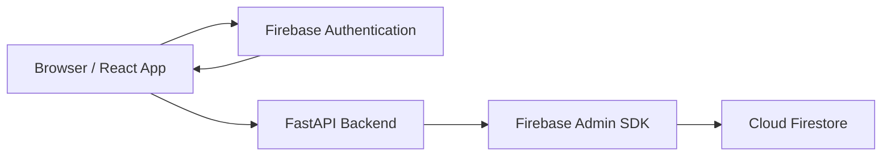

# Personal Notebook


Personal Notebook is a full-stack note-taking application built with React, FastAPI, Firebase Authentication, and Firestore. It uses Google sign-in on the frontend and verifies Firebase ID tokens on the backend before reading or writing user-owned notes.

The project is intentionally small, but structured like a production-ready GitHub repository: clear frontend/backend boundaries, environment-based configuration, typed API schemas, deployment notes, and security guidance.

## Features

- Google sign-in with Firebase Authentication
- Authenticated note creation, listing, and deletion
- User-scoped Firestore records enforced by backend token verification
- Environment-based configuration for local development and deployment
- FastAPI OpenAPI documentation at `/docs`
- Clean monorepo-style structure with separate frontend and backend apps

## Tech Stack

| Layer | Technology | Purpose |
| --- | --- | --- |
| Frontend | React 18 | Component-based user interface |
| Frontend tooling | Vite 7 | Local dev server and production bundling |
| Authentication | Firebase Authentication | Google OAuth sign-in and ID tokens |
| Backend | FastAPI | HTTP API, routing, validation, and OpenAPI docs |
| Backend runtime | Python 3.12 | API runtime |
| Data store | Cloud Firestore | Per-user note storage |
| Backend SDK | Firebase Admin SDK | Token verification and privileged Firestore access |
| Deployment targets | Vercel, Netlify, Railway, Render, Fly.io | Static frontend and Python API hosting |

## Architecture



The frontend signs users in with Firebase Authentication and sends the Firebase ID token to the FastAPI backend in an `Authorization: Bearer <token>` header. The backend verifies the token with Firebase Admin SDK and scopes all note operations to the authenticated user ID.

## Project Structure

```text
personal-notebook-app/
├── backend/
│   ├── app/
│   │   ├── main.py          # FastAPI app setup
│   │   ├── firebase.py      # Firebase Admin initialization
│   │   ├── dependencies.py  # Authentication dependencies
│   │   ├── schemas.py       # Pydantic API schemas
│   │   └── routers/
│   │       ├── health.py
│   │       └── notes.py
│   ├── requirements.txt
│   ├── Procfile
│   └── railway.json
├── frontend/
│   ├── src/
│   │   ├── components/
│   │   ├── App.jsx
│   │   ├── api.js
│   │   └── firebase.js
│   ├── package.json
│   └── vite.config.js
├── docs/
│   ├── deployment.md
│   └── firebase.md
├── .env.example
├── package.json
└── requirements.txt
```

## Prerequisites

- Node.js 20 or newer
- npm 10 or newer
- Python 3.12 or newer
- A Firebase project with Authentication and Firestore enabled

## Getting Started

### 1. Clone the repository

```bash
git clone <repository-url>
cd personal-notebook-app
```

### 2. Configure environment variables

Copy the example environment file:

```bash
cp .env.example .env
```

Fill in the Firebase Web App values and backend credential settings. Vite is configured to read `.env` from the repository root.

For local backend development, place your Firebase service account file at:

```text
backend/serviceAccountKey.json
```

This file is ignored by Git and must never be committed.

For detailed Firebase setup instructions, see [docs/firebase.md](docs/firebase.md).

### 3. Install dependencies

Install frontend dependencies:

```bash
npm run install:frontend
```

Create and activate a Python virtual environment:

```bash
python -m venv .venv
source .venv/bin/activate
pip install -r backend/requirements.txt
```

PowerShell activation on Windows:

```powershell
.\.venv\Scripts\Activate.ps1
```

### 4. Start the development servers

Start the backend:

```bash
npm run dev:backend
```

Start the frontend in another terminal:

```bash
npm run dev:frontend
```

Default local URLs:

| Service | URL |
| --- | --- |
| Frontend | http://localhost:5173 |
| Backend | http://localhost:8000 |
| API docs | http://localhost:8000/docs |
| Health check | http://localhost:8000/health |

## Environment Variables

| Variable | Scope | Required | Description |
| --- | --- | --- | --- |
| `VITE_API_BASE_URL` | Frontend | Yes | Base URL for the FastAPI backend |
| `VITE_FIREBASE_API_KEY` | Frontend | Yes | Firebase Web App API key |
| `VITE_FIREBASE_AUTH_DOMAIN` | Frontend | Yes | Firebase Auth domain |
| `VITE_FIREBASE_PROJECT_ID` | Frontend | Yes | Firebase project ID |
| `VITE_FIREBASE_STORAGE_BUCKET` | Frontend | Yes | Firebase storage bucket |
| `VITE_FIREBASE_MESSAGING_SENDER_ID` | Frontend | Yes | Firebase messaging sender ID |
| `VITE_FIREBASE_APP_ID` | Frontend | Yes | Firebase Web App ID |
| `ALLOWED_ORIGINS` | Backend | Yes | Comma-separated list of allowed frontend origins |
| `FIREBASE_CREDENTIALS_PATH` | Backend | Local only | Path to a local service account JSON file |
| `FIREBASE_CREDENTIALS_JSON` | Backend | Production recommended | Service account JSON as a single-line string |

## API Reference

All note endpoints require a Firebase ID token:

```http
Authorization: Bearer <firebase-id-token>
```

| Method | Path | Description |
| --- | --- | --- |
| `GET` | `/health` | Check whether the API is running |
| `GET` | `/notes` | List notes for the authenticated user |
| `POST` | `/notes` | Create a note for the authenticated user |
| `DELETE` | `/notes/{note_id}` | Delete one of the authenticated user's notes |

Create note request body:

```json
{
  "text": "Write something worth remembering."
}
```

## Scripts

Root-level scripts:

| Command | Description |
| --- | --- |
| `npm run install:frontend` | Install frontend dependencies |
| `npm run dev:frontend` | Start the Vite development server |
| `npm run build:frontend` | Build the frontend for production |
| `npm run preview:frontend` | Preview the production frontend build |
| `npm run dev:backend` | Start the FastAPI backend with reload |

Backend can also be started directly:

```bash
uvicorn app.main:app --reload --app-dir backend
```

## Deployment

Recommended deployment model:

- Deploy `frontend/` as a static site.
- Deploy `backend/` as a Python/FastAPI service.
- Use Firebase for Authentication and Firestore.

See [docs/deployment.md](docs/deployment.md) for platform-specific guidance.

## Security

- Do not commit `.env`, `backend/serviceAccountKey.json`, or any Firebase service account credential.
- Firebase Web App config is safe to expose in the browser, but Firebase service account credentials are backend-only secrets.
- Set `ALLOWED_ORIGINS` to trusted production domains in deployed environments.
- Review [SECURITY.md](SECURITY.md) before publishing or accepting external contributions.

## Contributing

Contributions are welcome. Please read [CONTRIBUTING.md](CONTRIBUTING.md) before opening a pull request.

## License

No license has been added yet. Add a license before distributing this project publicly.
