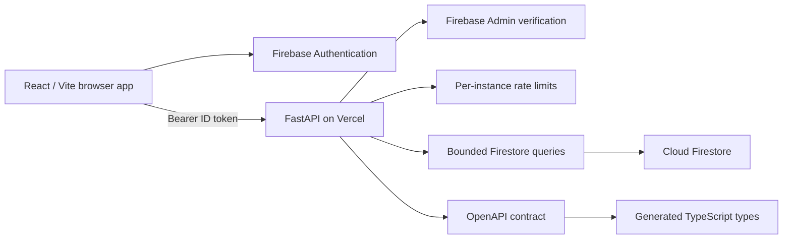

# NoteVault

NoteVault is a production-oriented, Markdown-first notebook built with React 18, TypeScript, Vite, FastAPI, Firebase Authentication, Firebase Admin SDK, and Cloud Firestore. The browser signs in with Google and sends a Firebase ID token to FastAPI; the API derives the trusted UID and scopes every note operation to it.

## Features

- Google sign-in/sign-out and backend Firebase ID-token verification
- User-isolated create, read, edit, and delete operations
- Markdown write/preview and safe GitHub Flavored Markdown rendering
- Normalized tags, text search, exact tag filtering, and clear-filter flows
- Reusable left Composer for editing, with save/cancel and unsaved-change confirmation
- Stable cursor pagination and a Load more interaction that appends and deduplicates notes
- `createdAt` preservation and an optional `updatedAt` timestamp for legacy compatibility
- Abortable initial and pagination requests with stale-response protection
- Existing responsive NoteVault design system, keyboard access, focus management, and reduced motion
- Vitest/Testing Library integration tests, Playwright E2E, pytest, coverage gates, OpenAPI type generation, and GitHub Actions

## Architecture


```mermaid
flowchart LR
  browser["React / Vite browser app"] --> auth["Firebase Authentication"]
  browser -->|"Bearer ID token"| api["FastAPI on Vercel"]
  api --> verify["Firebase Admin verification"]
  api --> limiter["Per-instance rate limits"]
  api --> query["Bounded Firestore queries"]
  query --> firestore["Cloud Firestore"]
  api --> openapi["OpenAPI contract"]
  openapi --> types["Generated TypeScript types"]
```

The browser never accesses Firestore directly. Presentation components never call Firebase or HTTP directly; adapters and hooks own those concerns. See [docs/architecture.md](docs/architecture.md).

## Project structure

```text
notevault/
|-- frontend/
|   |-- src/app/
|   |-- src/features/auth/
|   |-- src/features/notes/
|   |   |-- api.ts
|   |   |-- generated.ts
|   |   |-- hooks/useNotes.ts
|   |   `-- components/
|   |-- tests/e2e/
|   `-- playwright.config.ts
|-- backend/
|   |-- app/
|   |-- scripts/
|   |-- tests/
|   `-- openapi.json
|-- docs/
|-- firestore.indexes.json
`-- .github/workflows/ci.yml
```

## Getting started

Prerequisites: Node.js 20+, npm 10+, Python 3.12+, and a Firebase project with Google Authentication and Firestore enabled.

```bash
git clone https://github.com/Yangjunjie-Lin/notevault.git
cd notevault
npm ci
npm --prefix frontend ci
python -m venv .venv
python -m pip install -r backend/requirements-dev.txt
```

Copy `.env.example` to the appropriate untracked local environment file and add the Firebase Web App values. Store local Admin credentials only at `backend/serviceAccountKey.json` or in an untracked backend environment variable.

Start the services in separate terminals:

```bash
npm run dev:backend
npm run dev:frontend
```

Local URLs are `http://localhost:5173`, `http://localhost:8000`, and `http://localhost:8000/docs`.

## Environment variables

| Variable | Scope | Description |
| --- | --- | --- |
| `VITE_API_BASE_URL` | frontend | Exact FastAPI base URL |
| `VITE_FIREBASE_*` | frontend | Firebase Web App configuration |
| `ENVIRONMENT` | backend | Set to `production` in production |
| `ALLOWED_ORIGINS` | backend | Comma-separated exact browser origins; wildcard is rejected in production |
| `FIREBASE_CREDENTIALS_JSON` | backend | Single-line service account JSON, stored only as a platform secret |
| `FIREBASE_CREDENTIALS_PATH` | backend/local | Optional local credential path |
| `CURSOR_SIGNING_KEY` | backend | At least 32 characters in production; signs and binds pagination cursors |
| `APP_NAME`, `APP_VERSION` | backend | Optional OpenAPI metadata |

`VITE_TEST_AUTH` is not a production setting. It is accepted only by the Vite `e2e` mode; a production build fails immediately if the flag is enabled. Playwright starts a separate test-only backend module, so CI does not require Google OAuth or Firebase credentials.

## API reference

All `/notes` endpoints require `Authorization: Bearer <firebase-id-token>`.

| Method | Path | Description |
| --- | --- | --- |
| `GET` | `/health` | Public health check |
| `GET` | `/notes?limit=20&cursor=...&q=...&tag=...` | List an authenticated user's notes |
| `POST` | `/notes` | Create a note |
| `PATCH` | `/notes/{note_id}` | Update owned Markdown and tags |
| `DELETE` | `/notes/{note_id}` | Delete an owned note |

Create/update body:

```json
{
  "text": "## Weekly plan\n\n- Ship tests",
  "tags": ["work", "planning"]
}
```

Update response:

```json
{
  "note": {
    "id": "note-id",
    "text": "## Weekly plan\n\n- Ship tests",
    "tags": ["work", "planning"],
    "createdAt": 1780000000000,
    "updatedAt": 1780001000000
  }
}
```

Legacy notes without `updatedAt` return `null`. Clients cannot submit `uid`; unknown request fields are rejected. Missing notes and notes owned by another user both return 404.

List response:

```json
{
  "notes": [],
  "nextCursor": null,
  "hasMore": false,
  "searchLimited": false
}
```

`limit` defaults to 20 and is restricted to 1–50. Cursors are opaque HMAC-signed values bound to the verified UID and active filters. Unfiltered queries use Firestore ordering by `createdAt desc` with document ID as the stable secondary order.

### Search trade-off

Firestore is not a substring full-text engine. When `q` or `tag` is present, the API reads at most the most recent 200 owned notes, normalizes them, and filters that bounded set in memory. `searchLimited: true` tells the UI that older notes were not scanned. This avoids unbounded reads without introducing Algolia, Elasticsearch, or another paid service.

## Firestore index and timestamp migration

Deploy [firestore.indexes.json](firestore.indexes.json). The required composite index is:

```text
notes: uid ASC, createdAt DESC
```

Firestore supplies document ID ordering as the stable final key. Current writes store millisecond integers. The API can read legacy Firestore Timestamp values, but mixed field types cannot provide globally chronological Firestore pagination. Audit and normalize legacy values before enabling pagination on an existing database:

```bash
python backend/scripts/normalize_note_timestamps.py
python backend/scripts/normalize_note_timestamps.py --apply
```

The first command is a dry run.

## Quality gates

```bash
npm ci
npm run typecheck:frontend
npm run test:frontend
npm run test:coverage
npm run build:frontend

python -m pip install -r backend/requirements-dev.txt
python -m compileall backend/app
python -m pytest backend/tests
npm run test:backend:coverage

npm run contract:check
npm run test:e2e
npm run check
```

Frontend coverage thresholds are 80% lines/functions/statements and 70% branches. Backend coverage must be at least 85%. Generated OpenAPI types and application bootstrap are the only coverage exclusions.

`npm run contract:generate` exports FastAPI OpenAPI to `backend/openapi.json` and regenerates `frontend/src/features/notes/generated.ts`. CI runs `contract:check` and fails if committed contracts are stale.

## Production

| Target | URL |
| --- | --- |
| Frontend | https://notevault-lovat.vercel.app |
| API health | https://notevault-api.vercel.app/health |
| API docs | https://notevault-api.vercel.app/docs |
| OpenAPI | https://notevault-api.vercel.app/openapi.json |

The Vercel monorepo uses two Projects: frontend root `frontend` (Vite, `npm ci`, `npm run build`, `dist`) and backend root `backend` (FastAPI entrypoint `app.main:app`). See [docs/deployment.md](docs/deployment.md) for environment, aliases, smoke checks, and rollback notes.

Production limitations:

- Search covers the most recent 200 owned notes, not an unlimited full-text corpus.
- Rate limiting is in-memory and best-effort per warm Vercel instance, not distributed.
- Firebase Authorized Domains must include the exact frontend hostname.
- Firestore index creation and any legacy timestamp migration are operator steps.

## Security and contributing

Never commit `.env`, `.vercel/`, service account JSON, private keys, real tokens, or production credentials. Read [SECURITY.md](SECURITY.md), [CONTRIBUTING.md](CONTRIBUTING.md), and [docs/firestore-security-rules.md](docs/firestore-security-rules.md) before changing authentication or data access.

NoteVault is released under the [MIT License](LICENSE).
