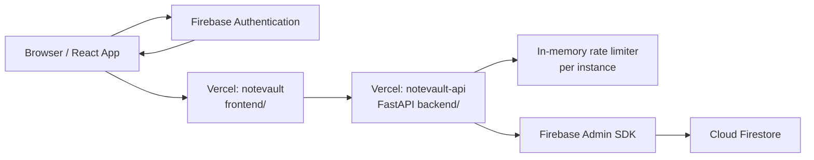

# NoteVault


NoteVault is a full-stack, Markdown-first note-taking application built with React, TypeScript, FastAPI, Firebase Authentication, and Firestore. It uses Google sign-in on the frontend and verifies Firebase ID tokens on the backend before reading or writing user-owned notes.

The repository is structured as a production-oriented GitHub project: clear frontend/backend boundaries, environment-based configuration, typed API schemas, documented deployment paths, security guidance, automated tests, and a CI workflow.

## Features

- Google sign-in with Firebase Authentication
- User-scoped notes enforced by backend Firebase ID token verification
- Search across note text and tags
- Tag creation and tag-based filtering
- Markdown writing with live preview and rendered note display
- Responsive, keyboard-accessible workspace with complete loading, empty, error, and confirmation states
- Clickable note tags for instant filtering and explicit filter reset flows
- Abortable note queries that prevent stale responses from overwriting newer results
- Strict TypeScript checks and integration tests for every primary UI action
- Per-user in-memory API rate limiting for note endpoints (best-effort; not a distributed global limiter on Vercel)
- FastAPI OpenAPI documentation at `/docs`
- Backend pytest coverage with a fake Firestore test double
- Frontend React smoke test with Vitest and Testing Library
- Firestore Security Rules guidance for the backend-only access model

## Tech Stack

| Layer | Technology | Purpose |
| --- | --- | --- |
| Frontend | React 18 + TypeScript | Type-safe, component-based user interface |
| Frontend tooling | Vite 7 | Local dev server and production bundling |
| Markdown | react-markdown, remark-gfm | Safe Markdown preview and rendering |
| Frontend tests | Vitest, Testing Library, jsdom | Integration testing authentication and note workflows |
| Authentication | Firebase Authentication | Google OAuth sign-in and ID tokens |
| Backend | FastAPI | HTTP API, routing, validation, and OpenAPI docs |
| Backend runtime | Python 3.12 | API runtime |
| Backend tests | pytest, FastAPI TestClient | API behavior and user isolation tests |
| Data store | Cloud Firestore | Per-user note storage |
| Backend SDK | Firebase Admin SDK | Token verification and privileged Firestore access |
| CI | GitHub Actions | Frontend tests/build/audit and backend tests |
| Deployment targets | Vercel (primary), Railway/Render (backend alternatives) | Frontend + FastAPI hosted as two Vercel Projects from one monorepo |

## Architecture


```mermaid
flowchart LR
  browser["Browser / React App"] --> auth["Firebase Authentication"]
  browser --> frontend["Vercel: notevault\nfrontend/"]
  frontend --> api["Vercel: notevault-api\nFastAPI backend/"]
  api --> limiter["In-memory rate limiter\nper instance"]
  api --> admin["Firebase Admin SDK"]
  admin --> firestore["Cloud Firestore"]
  auth --> browser
```

The frontend signs users in with Firebase Authentication and sends the Firebase ID token to the FastAPI backend in an `Authorization: Bearer <token>` header. The backend verifies the token with Firebase Admin SDK, applies a per-user rate limit, and scopes note operations to the authenticated Firebase user ID. Notes are not accessed directly from the browser against Firestore. See [docs/architecture.md](docs/architecture.md) for module boundaries, state ownership, request flow, and extension rules.

## Project Structure

```text
notevault/
|-- .github/
|   |-- workflows/ci.yml
|   |-- pull_request_template.md
|   `-- ISSUE_TEMPLATE/
|-- backend/
|   |-- app/
|   |   |-- main.py
|   |   |-- firebase.py
|   |   |-- dependencies.py
|   |   |-- rate_limit.py
|   |   |-- schemas.py
|   |   `-- routers/
|   |-- tests/
|   |-- requirements.txt
|   `-- requirements-dev.txt
|-- frontend/
|   |-- src/
|   |   |-- app/                 # Composition root and integration tests
|   |   |-- features/
|   |   |   |-- auth/           # Firebase adapter and auth UI
|   |   |   `-- notes/          # Note API, types, and workflow UI
|   |   |-- shared/components/  # Cross-feature feedback primitives
|   |   |-- styles/             # Design tokens and responsive system
|   |   `-- main.tsx
|   |-- tsconfig.json
|   |-- package.json
|   `-- vite.config.ts
|-- docs/
|   |-- architecture.md
|   |-- deployment.md
|   |-- firebase.md
|   `-- firestore-security-rules.md
|-- .env.example
|-- package.json
`-- requirements.txt
```

## Prerequisites

- Node.js 20 or newer
- npm 10 or newer
- Python 3.12 or newer
- A Firebase project with Authentication and Firestore enabled

## Getting Started

### 1. Clone the repository

```bash
git clone https://github.com/Yangjunjie-Lin/personal-notebook-app.git
cd personal-notebook-app
```

### 2. Configure environment variables

Copy the example environment file:

```bash
cp .env.example .env
```

Fill in the Firebase Web App values and backend credential settings. Vite is configured to read `.env` from the repository root.

For local backend development, place your Firebase service account file at:

```text
backend/serviceAccountKey.json
```

This file is ignored by Git and must never be committed.

For detailed Firebase setup instructions, see [docs/firebase.md](docs/firebase.md).

### 3. Install dependencies

Install frontend dependencies:

```bash
npm run install:frontend
```

Create and activate a Python virtual environment:

```bash
python -m venv .venv
source .venv/bin/activate
pip install -r backend/requirements-dev.txt
```

PowerShell activation on Windows:

```powershell
.\.venv\Scripts\Activate.ps1
```

### 4. Start the development servers

Start the backend:

```bash
npm run dev:backend
```

Start the frontend in another terminal:

```bash
npm run dev:frontend
```

Default local URLs:

| Service | URL |
| --- | --- |
| Frontend | http://localhost:5173 |
| Backend | http://localhost:8000 |
| API docs | http://localhost:8000/docs |
| Health check | http://localhost:8000/health |

## Environment Variables

| Variable | Scope | Required | Description |
| --- | --- | --- | --- |
| `VITE_API_BASE_URL` | Frontend | Yes | Base URL for the FastAPI backend |
| `VITE_FIREBASE_API_KEY` | Frontend | Yes | Firebase Web App API key |
| `VITE_FIREBASE_AUTH_DOMAIN` | Frontend | Yes | Firebase Auth domain |
| `VITE_FIREBASE_PROJECT_ID` | Frontend | Yes | Firebase project ID |
| `VITE_FIREBASE_STORAGE_BUCKET` | Frontend | Yes | Firebase storage bucket |
| `VITE_FIREBASE_MESSAGING_SENDER_ID` | Frontend | Yes | Firebase messaging sender ID |
| `VITE_FIREBASE_APP_ID` | Frontend | Yes | Firebase Web App ID |
| `ALLOWED_ORIGINS` | Backend | Yes | Comma-separated list of allowed frontend origins (exact origins in production; `*` rejected when `ENVIRONMENT=production`) |
| `ENVIRONMENT` | Backend | Production recommended | Set to `production` on Vercel |
| `APP_NAME` / `APP_VERSION` | Backend | Optional | OpenAPI metadata overrides |
| `FIREBASE_CREDENTIALS_PATH` | Backend | Local only | Path to a local service account JSON file |
| `FIREBASE_CREDENTIALS_JSON` | Backend | Production required | Service account JSON as a single-line string |

## API Reference

All note endpoints require a Firebase ID token:

```http
Authorization: Bearer <firebase-id-token>
```

| Method | Path | Description |
| --- | --- | --- |
| `GET` | `/health` | Check whether the API is running |
| `GET` | `/notes?q=<query>&tag=<tag>` | List notes for the authenticated user, optionally filtered by search query and tag |
| `POST` | `/notes` | Create a note for the authenticated user |
| `DELETE` | `/notes/{note_id}` | Delete one of the authenticated user's notes |

Create note request body:

```json
{
  "text": "## Weekly plan\n\n- Ship tests\n- Update docs",
  "tags": ["work", "planning"]
}
```

## Quality Gates

These commands are also encoded in [.github/workflows/ci.yml](.github/workflows/ci.yml).

| Check | Command |
| --- | --- |
| Frontend type check | `npm run typecheck:frontend` |
| Frontend integration tests | `npm run test:frontend` |
| Frontend production build | `npm run build:frontend` |
| Frontend production dependency audit | `cd frontend && npm audit --omit=dev` |
| Backend tests | `npm run test:backend` |
| Backend import/bytecode check | `python -m compileall backend/app` |

Run the full local test suite:

```bash
npm test
```

## Scripts

Root-level scripts:

| Command | Description |
| --- | --- |
| `npm run install:frontend` | Install frontend dependencies |
| `npm run dev:frontend` | Start the Vite development server |
| `npm run build:frontend` | Build the frontend for production |
| `npm run preview:frontend` | Preview the production frontend build |
| `npm run dev:backend` | Start the FastAPI backend with reload |
| `npm run typecheck:frontend` | Run strict TypeScript validation |
| `npm run test:frontend` | Run frontend integration tests |
| `npm run check:frontend` | Type-check, test, and build the frontend |
| `npm run test:backend` | Run backend pytest tests |
| `npm test` | Run frontend and backend tests |
| `npm run check` | Run the complete local quality gate |

Backend can also be started directly:

```bash
uvicorn app.main:app --reload --app-dir backend
```

## Deployment Links

| Target | Link |
| --- | --- |
| Frontend live app | [Open NoteVault](https://notevault-lovat.vercel.app) |
| Backend health check | [Health](https://notevault-api.vercel.app/health) |
| Backend API docs | [Swagger UI](https://notevault-api.vercel.app/docs) |
| OpenAPI schema | [openapi.json](https://notevault-api.vercel.app/openapi.json) |
| Deployment guide | [docs/deployment.md](docs/deployment.md) |
| Railway backend config (alternative) | [backend/railway.json](backend/railway.json) |
| Vercel frontend config | [frontend/vercel.json](frontend/vercel.json) |
| Backend Vercel entrypoint | [backend/pyproject.toml](backend/pyproject.toml) |
| CI workflow | [.github/workflows/ci.yml](.github/workflows/ci.yml) |
| License | [LICENSE](LICENSE) |

Production deployment model:

- Same GitHub repository, two Vercel Projects: `notevault` (`frontend/`) and `notevault-api` (`backend/`).
- Firebase Authentication + Firestore via Firebase Admin on the backend only.
- Railway remains an optional backend alternative; Vercel is the current official production stack.

### Production limitations

- In-memory rate limiting is best-effort per Vercel serverless instance, not a durable cluster-wide limiter.
- Authenticated note CRUD requires `FIREBASE_CREDENTIALS_JSON` on the backend Vercel project and the frontend hostname in Firebase Authorized Domains.

## Security

- Do not commit `.env`, `backend/serviceAccountKey.json`, or any Firebase service account credential.
- Firebase Web App config is safe to expose in the browser, but Firebase service account credentials are backend-only secrets.
- Set `ALLOWED_ORIGINS` to trusted production domains in deployed environments.
- Use [docs/firestore-security-rules.md](docs/firestore-security-rules.md) to configure Firestore for the backend-only access model.
- Review [SECURITY.md](SECURITY.md) before publishing or accepting external contributions.

## Contributing

Contributions are welcome. Please read [CONTRIBUTING.md](CONTRIBUTING.md) before opening a pull request.

## License

This project is released under the [MIT License](LICENSE). Copyright (c) 2026 Yangjunjie Lin.
