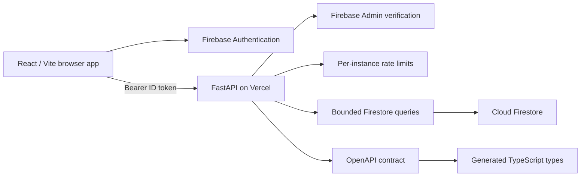

# NoteVault — production-oriented Markdown notebook

[](https://github.com/Yangjunjie-Lin/notevault/actions/workflows/ci.yml)


NoteVault is a feature-complete Markdown notebook with Firebase-authenticated user isolation, a typed FastAPI contract, mutation-safe timeline cursor pagination, bounded filtered search, and automated cross-browser quality gates.

**Live app:** [https://notevault-lovat.vercel.app](https://notevault-lovat.vercel.app) · **API docs:** [https://notevault-api.vercel.app/docs](https://notevault-api.vercel.app/docs)

**Project status:** Stable · feature-complete · production deployed · maintenance mode · portfolio flagship.

## Why NoteVault

- **Verified identity boundary:** the browser obtains Firebase ID tokens and the FastAPI backend verifies them before every note operation.
- **User-isolated storage:** create, read, update, and delete operations are scoped by the verified UID; missing and cross-user note IDs share the same 404 behavior.
- **Typed API contract:** FastAPI OpenAPI is committed and generates the frontend TypeScript contract; CI fails on drift.
- **Reliable pagination:** signed HMAC cursors keep the main timeline moving when a boundary note is edited or deleted.
- **Explicit search trade-off:** filtered search scans at most the 200 most recent owned notes instead of claiming unlimited full-text search.
- **Release-grade verification:** frontend/backend coverage gates, production-preview Playwright, axe, Firestore Emulator integration, production-auth rejection, dependency audit, and repository-hygiene checks.

## Features

- Google sign-in/sign-out with backend Firebase ID-token verification
- User-scoped note creation, reading, editing, and deletion
- Markdown write/preview with raw HTML disabled and safe URL handling
- Normalized tags, text search, exact tag filtering, and clear-filter flows
- Reusable Composer edit mode with save/cancel and unsaved-change confirmation
- Signed timeline cursor pagination with append-and-deduplicate Load more behavior
- Bounded filtered search with visible `searchLimited` feedback
- Preserved `createdAt` and optional `updatedAt` compatibility for legacy notes
- Abortable requests, stale-response protection, keyboard access, focus restoration, reduced motion, and responsive mobile layouts

## Quality evidence

| Area | Maintained gate |
| --- | --- |
| Frontend | TypeScript, Vitest/Testing Library, coverage ≥80% lines/functions/statements and ≥70% branches, production build |
| Backend | Python compile check, pytest, coverage ≥85%, sanitized error contracts |
| API contract | Generated OpenAPI JSON and TypeScript types with a CI drift check |
| Browsers | Chromium full workflow; Firefox/WebKit core smoke; maintained mobile viewport and axe states |
| Data layer | Real Firestore SDK integration under the Firestore Emulator |
| Security | Production auth-bypass rejection, dependency audit, explicit CORS/signing-key requirements, secret hygiene |
| Release | Package, frontend, backend, OpenAPI, changelog, and release-note version consistency |

## Architecture


```mermaid
flowchart LR
  browser["React / Vite browser app"] --> auth["Firebase Authentication"]
  browser -->|"Bearer ID token"| api["FastAPI on Vercel"]
  api --> verify["Firebase Admin verification"]
  api --> limiter["Per-instance rate limits"]
  api --> query["Bounded Firestore queries"]
  query --> firestore["Cloud Firestore"]
  api --> openapi["OpenAPI contract"]
  openapi --> types["Generated TypeScript types"]
```

The browser does not access Firestore directly. Presentation components do not call Firebase or HTTP directly; adapters and hooks own those concerns. See [docs/architecture.md](docs/architecture.md).

## Pagination and search guarantees

The unfiltered timeline uses opaque version 2 HMAC-SHA256 cursors bound to the verified UID, mode, filter fingerprint, `createdAt`, and document ID. Editing or deleting the boundary note does not invalidate the continuation key. This provides stable continuation, not a frozen database snapshot.

Firestore is not a substring full-text engine. When `q` or `tag` is active, NoteVault scans at most the 200 most recent owned notes, filters them in memory, and paginates the bounded result with a signed offset. Concurrent matching mutations can shift later filtered pages. The API exposes `searchLimited: true` when older notes were not scanned.

## Local development

Prerequisites: Node.js 20–22, npm 10+, Python 3.12–3.13, Java 21+ for the Firestore Emulator, and a Firebase project with Google Authentication and Firestore enabled.

```bash
git clone https://github.com/Yangjunjie-Lin/notevault.git
cd notevault
npm ci
npm --prefix frontend ci
```

Create a Python environment and install backend dependencies:

```bash
python3.12 -m venv .venv
source .venv/bin/activate
python -m pip install -r backend/requirements-dev.txt
```

On Windows PowerShell, activate with `.venv\Scripts\Activate.ps1`.

Copy `.env.example` to the appropriate untracked environment file, then start both services:

```bash
npm run dev:backend
npm run dev:frontend
```

Local URLs are `http://localhost:5173`, `http://localhost:8000`, and `http://localhost:8000/docs`.

## Verification

```bash
npm run release:check
npm run check
npm run test:e2e
npm run test:firebase-integration
```

`npm run verify` runs the maintained local release gates. Playwright uses a separate test-only backend and Vite `e2e` mode; an ordinary production build fails if test authentication is enabled.

## API overview

All `/notes` endpoints require `Authorization: Bearer <firebase-id-token>`.

| Method | Path | Purpose |
| --- | --- | --- |
| `GET` | `/health` | Public health check |
| `GET` | `/notes?limit=20&cursor=...&q=...&tag=...` | List an authenticated user's notes |
| `POST` | `/notes` | Create a note |
| `PATCH` | `/notes/{note_id}` | Update owned Markdown and tags |
| `DELETE` | `/notes/{note_id}` | Delete an owned note |

Clients cannot submit `uid`; unknown fields are rejected. See the live [API documentation](https://notevault-api.vercel.app/docs) or committed [OpenAPI contract](backend/openapi.json).

## Production

| Target | URL |
| --- | --- |
| Frontend | https://notevault-lovat.vercel.app |
| API health | https://notevault-api.vercel.app/health |
| API docs | https://notevault-api.vercel.app/docs |
| OpenAPI | https://notevault-api.vercel.app/openapi.json |

The Vercel monorepo uses separate frontend and backend Projects. Production requires explicit `ALLOWED_ORIGINS`, a unique `CURSOR_SIGNING_KEY` of at least 32 characters, Firebase credentials stored as platform secrets, the exact frontend hostname in Firebase Authorized Domains, and the Firestore composite index `uid ASC, createdAt DESC`.

Rate limiting is best-effort per warm serverless instance, not globally distributed. Firestore index creation and legacy timestamp normalization remain operator steps. See [docs/deployment.md](docs/deployment.md) and [docs/maintenance.md](docs/maintenance.md).

## Documentation

- [Architecture](docs/architecture.md)
- [Deployment and rollback](docs/deployment.md)
- [Maintenance policy](docs/maintenance.md)
- [Firestore security rules](docs/firestore-security-rules.md)
- [v1.1.0 release notes](docs/release-notes-v1.1.0.md)
- [Changelog](CHANGELOG.md)

## Security and contributing

Never commit `.env`, `.vercel/`, service-account JSON, private keys, real tokens, or production credentials. Read [SECURITY.md](SECURITY.md) and [CONTRIBUTING.md](CONTRIBUTING.md) before changing authentication, data access, pagination, or deployment behavior.

Future work is limited to security, compatibility, reproducible bugs, accessibility, dependency support, and verified reliability improvements. New product-scope features are intentionally out of scope.

Released under the [MIT License](LICENSE).
