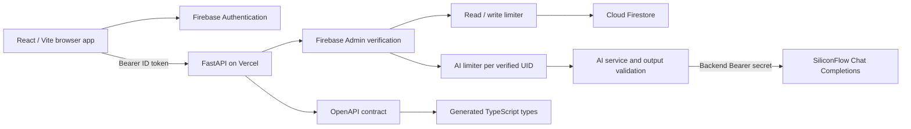

# NoteVault — production-oriented AI-assisted Markdown notebook

[](https://github.com/Yangjunjie-Lin/notevault/actions/workflows/ci.yml)


NoteVault is a Markdown notebook with Firebase-authenticated user isolation, a typed FastAPI contract, safe Markdown rendering, mutation-safe timeline cursors, bounded filtered search, and controlled AI editing. Version 1.2.0 adds automatic Markdown formatting and an in-composer AI Assist workflow powered by DeepSeek V4 Flash through SiliconFlow.

**Live app:** [https://notevault-lovat.vercel.app](https://notevault-lovat.vercel.app) · **API docs:** [https://notevault-api.vercel.app/docs](https://notevault-api.vercel.app/docs)

**Project status:** Active feature development · AI-assisted Markdown editing · production-oriented.

## Why NoteVault

- **Verified identity boundary:** the browser obtains a Firebase ID token and FastAPI verifies it before every note or AI operation.
- **User-isolated storage:** note reads and writes are scoped by the verified UID; clients cannot choose their UID.
- **Controlled AI changes:** automatic formatting is reviewable, AI Assist produces a candidate, and neither flow silently overwrites a draft.
- **Server-only provider credential:** the browser calls NoteVault, never SiliconFlow; the SiliconFlow API key is a backend secret and must not use a `VITE_*` name.
- **Typed API contract:** FastAPI OpenAPI generates the frontend TypeScript contract and CI rejects drift.
- **Safe rendering:** AI and user Markdown use the same raw-HTML-disabled renderer, safe URL handling, and blocked remote Markdown images.
- **Release-grade verification:** frontend/backend coverage, provider mocks, production-preview Playwright, axe, Firestore Emulator integration, dependency audits, and repository hygiene are maintained gates.

## Features

- Google sign-in/sign-out with backend Firebase ID-token verification
- User-scoped note creation, reading, editing, and deletion
- Markdown write/preview with raw HTML disabled
- Automatic Markdown normalization before **Add note** and **Save changes**
- Review choices when formatting changes the draft: **Apply & Save**, **Save Original**, or **Cancel**
- Failure recovery that preserves the draft and offers retry or save-original paths
- In-composer **AI Assist** with iterative revision, preview/source views, retry, discard, close, and explicit **Apply to draft**
- Normalized tags, text search, exact tag filtering, signed cursor pagination, and bounded filtered search
- Abortable requests, stale-response protection, keyboard access, focus restoration, reduced motion, and responsive layouts

## AI behavior and data boundary

Automatic formatting sends the current note draft from the NoteVault backend to SiliconFlow once after the user initiates a save. If the result differs, the user reviews it before anything is written. Tags are not sent to or changed by the formatter.

AI Assist sends the current Markdown candidate and the user's editing instruction to SiliconFlow. A returned revision remains temporary browser session state until **Apply to draft** is selected, and applying still does not save the note. AI conversation state is not stored in Firestore.

> When AI formatting or AI Assist is used, the current note draft is sent from the NoteVault backend to SiliconFlow for processing.

NoteVault does not claim that provider processing is local, zero-knowledge, end-to-end encrypted, anonymous, or never retained. Review [AI privacy](docs/ai-privacy.md) and SiliconFlow's current policies before submitting sensitive content.

If SiliconFlow is unavailable, AI Assist reports a sanitized error without changing the draft. The save flow keeps the original draft available and permits an explicit save-original fallback; it never substitutes an empty AI response.

## Architecture


```mermaid
flowchart LR
  browser["React / Vite browser app"] --> auth["Firebase Authentication"]
  browser -->|"Bearer ID token"| api["FastAPI on Vercel"]
  api --> verify["Firebase Admin verification"]
  verify --> notesLimit["Read / write limiter"]
  notesLimit --> firestore["Cloud Firestore"]
  verify --> aiLimit["AI limiter per verified UID"]
  aiLimit --> aiService["AI service and output validation"]
  aiService -->|"Backend Bearer secret"| siliconflow["SiliconFlow Chat Completions"]
  api --> openapi["OpenAPI contract"]
  openapi --> types["Generated TypeScript types"]
```

The only provider call is `NoteVault backend → SiliconFlow`. The browser never receives the provider key, never calls the provider endpoint, and never accesses Firestore directly. See [architecture](docs/architecture.md) and [AI integration](docs/ai-integration.md).

## Local development

Prerequisites: Node.js 20–22, npm 10+, Python 3.12–3.13, Java 21+ for the Firestore Emulator, and a Firebase project with Google Authentication and Firestore enabled.

```bash
git clone https://github.com/Yangjunjie-Lin/notevault.git
cd notevault
npm ci
npm --prefix frontend ci
python3.12 -m venv .venv
```

Activate the environment (`source .venv/bin/activate` on macOS/Linux or `.venv\Scripts\Activate.ps1` on Windows PowerShell), then install backend dependencies:

```bash
python -m pip install -r backend/requirements-dev.txt
```

Copy `.env.example` to an ignored `.env`. Configure Firebase as before and, to enable AI endpoints, replace only the backend API-key placeholder:

```dotenv
SILICONFLOW_API_KEY=YOUR_SILICONFLOW_API_KEY_HERE
SILICONFLOW_BASE_URL=https://api.siliconflow.cn/v1
SILICONFLOW_MODEL=deepseek-ai/DeepSeek-V4-Flash
SILICONFLOW_TIMEOUT_SECONDS=45
SILICONFLOW_MAX_TOKENS=4096
SILICONFLOW_AI_RATE_LIMIT_PER_MINUTE=10
```

Never commit the populated `.env`, copy the key into `frontend/.env*`, or rename it to `VITE_SILICONFLOW_API_KEY`. If the key has appeared in chat, logs, source control, or another untrusted location, revoke it and create a replacement before deployment.

Start both services:

```bash
npm run dev:backend
npm run dev:frontend
```

Local URLs are `http://localhost:5173`, `http://localhost:8000`, and `http://localhost:8000/docs`. The application still starts and ordinary note operations still work without a SiliconFlow key; authenticated AI endpoints return a sanitized `503` until configured.

## API overview

All `/notes` and `/ai` endpoints require `Authorization: Bearer <firebase-id-token>`.

| Method | Path | Purpose |
| --- | --- | --- |
| `GET` | `/health` | Public health check |
| `GET` | `/notes?limit=20&cursor=...&q=...&tag=...` | List the authenticated user's notes |
| `POST` | `/notes` | Create a note |
| `PATCH` | `/notes/{note_id}` | Update owned Markdown and tags |
| `DELETE` | `/notes/{note_id}` | Delete an owned note |
| `POST` | `/ai/format-markdown` | Normalize a Markdown draft before save |
| `POST` | `/ai/revise-note` | Produce a complete revision candidate |

Clients cannot submit a UID, provider key, model, base URL, temperature, maximum token count, or system prompt. Request bodies reject unknown fields. See the live API documentation or committed [OpenAPI contract](backend/openapi.json).

## Verification

Ordinary CI and local automated tests mock the provider and must not use a real SiliconFlow key.

```bash
npm run release:check
npm run check
npm run test:e2e
npm run test:firebase-integration
python -m compileall backend/app
npm audit
npm --prefix frontend audit
npm --prefix frontend audit --omit=dev
```

`npm run verify` runs the maintained local release gates. OpenAPI generation remains deterministic through `npm run contract:generate`, and `npm run contract:check` rejects a generated contract diff.

## Production deployment

The Vercel monorepo uses separate Projects:

| Target | Root | URL |
| --- | --- | --- |
| Frontend | `frontend` | https://notevault-lovat.vercel.app |
| Backend | `backend` | https://notevault-api.vercel.app |

Configure all `SILICONFLOW_*` variables only in the backend `notevault-api` Project. The frontend Project needs `VITE_API_BASE_URL` and Firebase Web configuration, but no SiliconFlow secret. After building, scan frontend assets for provider-key names, direct provider endpoints, and token-shaped values; then perform an authenticated production smoke that exercises formatting review, AI Assist candidate application, and the provider-failure save-original fallback. Detailed steps are in [deployment](docs/deployment.md).

Rate limiting is best-effort per warm Vercel instance, not globally distributed. A provider outage degrades AI features while preserving ordinary note access and an explicit save-original path. AI sessions are not persisted, responses are non-streaming, and this release has no RAG, embeddings, vector database, or general knowledge chat.

## Documentation

- [Architecture](docs/architecture.md)
- [AI integration](docs/ai-integration.md)
- [AI privacy and data handling](docs/ai-privacy.md)
- [Deployment and rollback](docs/deployment.md)
- [Maintenance policy](docs/maintenance.md)
- [Firestore security rules](docs/firestore-security-rules.md)
- [v1.2.0 release notes](docs/release-notes-v1.2.0.md)
- [Changelog](CHANGELOG.md)

## Security and contributing

Never commit `.env`, `.vercel/`, service-account JSON, private keys, real tokens, provider credentials, or production configuration. Read [SECURITY.md](SECURITY.md) and [CONTRIBUTING.md](CONTRIBUTING.md) before changing authentication, AI boundaries, data access, pagination, or deployment behavior.

Released under the [MIT License](LICENSE).
