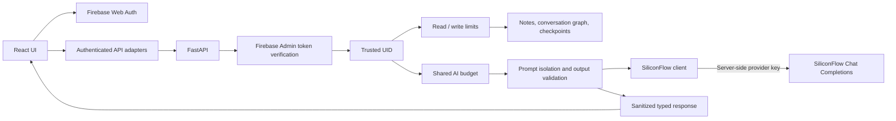
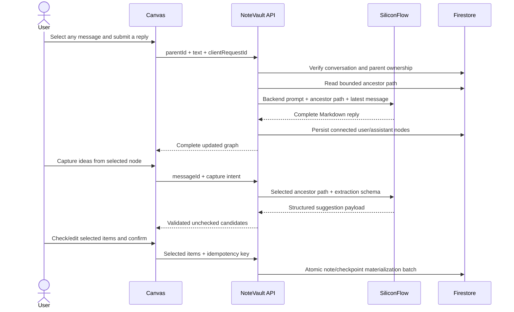
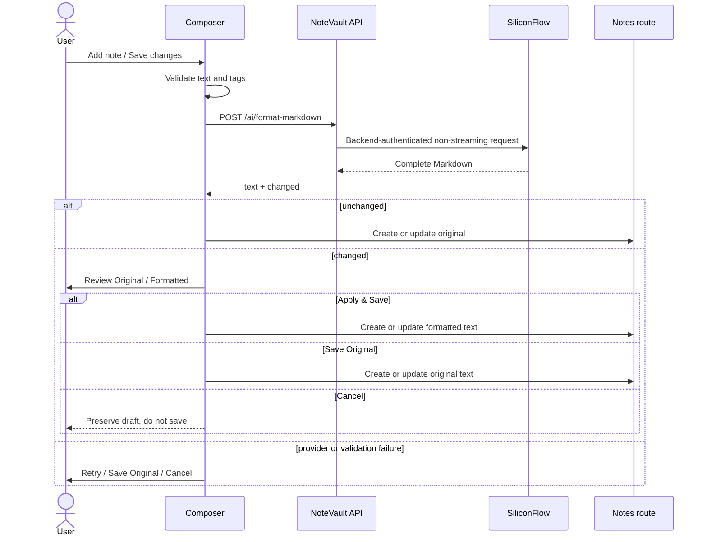

# NoteVault architecture

## Trust boundaries



The browser never supplies a trusted UID, never accesses Firestore directly, never receives `SILICONFLOW_API_KEY`, and never calls SiliconFlow. FastAPI verifies the Firebase bearer token before every note and AI request. Missing and cross-user note IDs share the same `404` behavior.

AI use crosses a third-party data boundary. Formatting sends the current Markdown draft; revision sends the current Markdown candidate and explicit editing instruction. AI Canvas sends only the selected node's bounded ancestor path and latest user message, or that path for capture extraction. Sibling branches, tags, Firebase tokens, UID values, and backend secrets are excluded from provider requests. See [ai-privacy.md](ai-privacy.md).

## Backend boundaries

```text
app/routers/notes.py       authenticated note persistence routes
app/routers/ai.py          authenticated AI HTTP contract and sanitized mapping
app/routers/conversations.py  owned conversation graph, branching, suggestions, and capture
app/routers/checkpoints.py    owned action checkpoint listing and completion state
app/ai/client.py           timeout-aware SiliconFlow HTTPS transport and bounded retry
app/ai/prompts.py          backend-owned formatter/editor system prompts and data delimiters
app/ai/service.py          request construction, output cleanup, validation, and result mapping
app/config.py              optional server-only AI settings and validation
app/rate_limit.py          read, write, and shared AI budgets keyed by verified UID
app/schemas.py             extra-forbidden note and AI request/response contracts
```

The dependency direction is `router -> service -> client`. Note routes do not contain provider HTTP calls or prompts. The provider key is read only by backend configuration and used only to create the server-side Authorization header.

The application can start without a provider key. In that state, normal note operations remain available and AI endpoints return a controlled `503`. Provider retries are bounded and limited to transient status/network categories; validation and configuration failures are not retried.

Backend logs exclude note text, revision instructions, bearer tokens, authorization headers, provider keys, and raw provider bodies. Optional provider trace ID, request kind, latency, status, and sanitized error category are the maximum allowed diagnostics.

## Frontend boundaries

```text
src/app/App.tsx                         composition, auth, confirmations
src/features/auth/firebase.ts          production Firebase/test-mode adapter
src/features/notes/api.ts              authenticated notes HTTP adapter
src/features/notes/hooks/useNotes.ts   pages, aborts, dedupe, note mutations
src/features/notes/components/         composer and note presentation
src/features/ai/api.ts                 authenticated typed AI adapter
src/features/ai/hooks/                 abortable AI session/controller state
src/features/ai/components/            disclosure, assist panel, result, review UI
src/features/conversations/api.ts       authenticated Canvas/checkpoint HTTP adapter
src/features/conversations/components/ graph layout, inspector, capture review, checkpoints
src/features/notes/generated.ts        generated OpenAPI schema types
src/shared/components/                 accessible feedback/dialog primitives
src/styles/app.css                     NoteVault design system
```

Presentation components do not call Firebase, FastAPI, or SiliconFlow directly. The AI adapter reuses the authenticated backend request boundary and supports `AbortSignal`. The AI controller owns panel/session state, candidate lineage, request versions, cancellation, and stale-response protection.

Changing the selected note, canceling/resetting the Composer, closing the panel, or signing out cancels active AI work and clears temporary candidate state. A candidate never automatically overwrites the main draft. If the main draft changes after candidate generation, the candidate is stale and cannot silently replace newer text.

AI Canvas is a separate persisted workflow. Each message stores a parent ID, so edges are derived rather than duplicated. Replying to an historical node builds provider context by walking that node's ancestors only; sibling branches are never mixed into the prompt. Long Markdown is summarized on graph cards and rendered in full through `SafeMarkdown` in the inspector. Below 640px, the same semantic tree items become a single-column outline and SVG edges are hidden.

Each completed Canvas turn uses deterministic document IDs and one Firestore write batch for its user node, assistant node, and conversation summary. Provider work completes before the batch begins. This prevents a storage interruption from retaining half of a turn while keeping external network calls outside Firestore atomic work.

Capture is a two-phase human-in-the-loop pipeline: the AI returns a strictly validated JSON envelope of review-only candidates, then the frontend initializes every item unchecked. The materialization endpoint accepts only the checked, user-editable items and uses a deterministic request receipt plus one Firestore write batch, so a repeated confirmation cannot duplicate notes or checkpoints. The provider is never called inside that batch and has no direct persistence tool. Deleting a Canvas removes its conversation/messages and capture receipts; confirmed notes/checkpoints intentionally remain independent user records.

## AI Canvas sequence



## Save-time formatting sequence



Tags remain in Composer/note persistence state and are never sent to the formatter. An empty or oversized result is a failure, never a save candidate.

## AI Assist sequence

```mermaid
sequenceDiagram
  actor User
  participant Composer
  participant Session as AI session controller
  participant API as NoteVault API
  participant AI as SiliconFlow

  User->>Session: Editing instruction
  Session->>API: POST /ai/revise-note with current candidate
  API->>AI: Backend-selected prompt and parameters
  AI-->>API: Complete revised Markdown
  API-->>Session: Validated candidate
  Session-->>User: Preview / source; draft unchanged
  User->>Session: Optional next instruction
  Note over Session: Next turn uses prior candidate
  User->>Composer: Apply to draft
  Note over Composer: Still dirty and not saved
```

The AI session is task-oriented browser state, not a persisted chat. AI Assist never invokes note create/update directly; normal save-time formatting still runs after a candidate is applied.

## Prompt and output boundary

Formatter and editor system prompts are backend-owned. The note is delimited as untrusted data. For revisions, the explicit user instruction is separately delimited so text embedded in the note is less likely to be treated as a replacement instruction. This reduces prompt-injection risk but cannot guarantee model compliance. Clients cannot choose provider configuration or system prompts.

Model output is not trusted simply because a prompt requests compliance. The service trims output, validates type and non-emptiness, removes a clearly detected whole-response Markdown fence, rejects oversized content, and returns only typed, sanitized data. Prompts prohibit raw HTML, and rendering remains through the existing safe Markdown component; raw HTML and `dangerouslySetInnerHTML` are not enabled.

## API contracts

FastAPI is the schema source. `backend/scripts/export_openapi.py` writes deterministic `backend/openapi.json`; `openapi-typescript` generates `frontend/src/features/notes/generated.ts`. CI regenerates both and rejects a diff.

AI request schemas accept only the bounded `text` field and, for revision, bounded `instruction`. UID, API key, model, base URL, temperature, maximum tokens, system prompt, and authorization header are forbidden extras. Response models expose the complete candidate, configured model, and optional trace ID; formatter responses also expose `changed`.

## Note query paths and mutation semantics

The unfiltered timeline queries by verified UID, orders by `createdAt` and document ID descending, and requests one extra document to determine `hasMore`. A version 2 HMAC-SHA256 cursor binds mode, verified UID, filter fingerprint, last document ID, and normalized creation time.

Search/tag filtering reads a bounded set of recent owned documents, filters in memory, and continues with a signed offset. It does not claim snapshot isolation. The client merges by ID, rejects stale responses, and does not render duplicate note IDs.

AI editing does not change these query or ownership semantics. Applying AI text preserves normal dirty state; saving follows the existing create/update contract and tags remain unchanged.

## Test boundaries

Ordinary automated tests mock the provider and never require a real SiliconFlow key. Provider request tests verify the official endpoint, server-side Bearer header, configured model, non-streaming parameters, prompt/data separation, retry bounds, response validation, and sanitized failures without recording secrets or note text.

The frontend test adapter activates only when both `MODE=e2e` and `VITE_TEST_AUTH=true`; the optimized E2E bundle uses an isolated test backend. Production `app.main:app` never imports test reset/seed routes. Firestore Emulator tests continue to exercise the real storage SDK independently of provider tests.

## Operational limitations

The AI limiter is per warm serverless instance, not distributed. SiliconFlow unavailability degrades new replies, extraction, formatting, and revision while leaving persisted conversations, checkpoints, normal notes, and the save-original recovery path available. Composer AI Assist remains temporary; AI Canvas is persistent. Responses are non-streaming, one graph is capped at 500 messages, and v1.3.0 contains no RAG, embeddings, vector store, external search, or autonomous tool calling.
