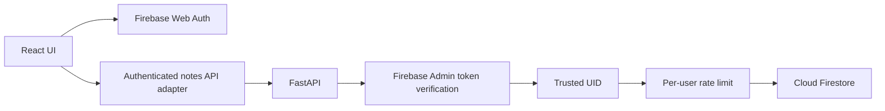

# NoteVault architecture

## Trust boundaries



The browser never supplies a trusted UID and never accesses Firestore directly. FastAPI verifies the bearer token, derives the UID, and applies it to every query and ownership check. Missing and cross-user note IDs both return 404.

## Frontend boundaries

```text
src/app/App.tsx                         composition, auth, confirmations
src/features/auth/firebase.ts          production Firebase/test-mode adapter
src/features/notes/api.ts              authenticated HTTP adapter
src/features/notes/generated.ts        generated OpenAPI schema types
src/features/notes/types.ts            aliases plus UI-only filter types
src/features/notes/hooks/useNotes.ts   pages, aborts, dedupe, mutations
src/features/notes/components/         presentation and composer state
src/shared/components/                 accessible feedback/dialog primitives
src/styles/app.css                     existing NoteVault design system
```

Presentation components do not call Firebase or HTTP. `useNotes` owns the active first-page request and a separate abortable pagination request. A monotonic request version prevents an older page from merging after a user, search, or tag change. Merge-by-ID deduplicates overlapping pages.

The Composer remains in the original left panel. Its mode is derived from the selected note; failed saves retain the local draft. App-level intent state handles cancel, another Edit action, and sign-out when the draft is dirty. The shared dialog provides focus trap, Escape, focus restore, backdrop handling, scroll lock, and disabled pending behavior.

## Data contracts

FastAPI is the schema source. `backend/scripts/export_openapi.py` writes deterministic `backend/openapi.json`; `openapi-typescript` generates `frontend/src/features/notes/generated.ts`. CI regenerates both and rejects a diff.

`NoteOut.updatedAt` is nullable so legacy notes remain valid. Current updates preserve `createdAt` and set millisecond `updatedAt`.

## Query paths

### Unfiltered list

```text
where uid == verified UID
order by createdAt descending
order by document ID descending
limit requested limit + 1
```

The extra document determines `hasMore`. The HMAC-signed cursor contains version, mode, UID, filter fingerprint, last document ID, and normalized creation time. The next request verifies the signature, UID, filter fingerprint, snapshot ownership, and timestamp before using `start_after(snapshot)`.

### Search or tag filter

Firestore cannot provide arbitrary substring search. The API queries at most 201 recent owned documents, uses the first 200 as a hard scan cap, normalizes timestamps, filters, and pages the bounded result. `searchLimited` is true when the cap was reached. A filtered cursor stores a signed offset and is bound to the normalized filters.

## Test authentication

The frontend test adapter activates only when both `MODE=e2e` and `VITE_TEST_AUTH=true`; a production build throws if the test flag is present. Playwright starts `tests.e2e_app:app`, which overrides authentication and Firestore in that dedicated process. The production entrypoint `app.main:app` never imports the test module, and CI stores no real token or Firebase credential.
