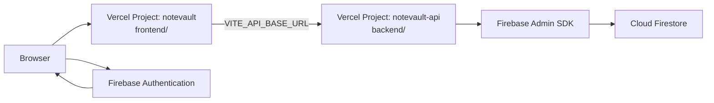

# Deployment

NoteVault is deployed as two Vercel Projects from the same GitHub monorepo.

## Production architecture



| Layer | Vercel Project | Root Directory | Production URL |
| --- | --- | --- | --- |
| Frontend | `notevault` | `frontend` | https://notevault-lovat.vercel.app |
| Backend API | `notevault-api` | `backend` | https://notevault-api.vercel.app |

Primary production hosting is Vercel for both services. Railway/Render remain optional alternatives for the FastAPI backend.

## Deployment links

| Target | URL |
| --- | --- |
| Frontend live app | https://notevault-lovat.vercel.app |
| Backend health check | https://notevault-api.vercel.app/health |
| Backend API docs | https://notevault-api.vercel.app/docs |
| OpenAPI schema | https://notevault-api.vercel.app/openapi.json |
| CI workflow | [.github/workflows/ci.yml](../.github/workflows/ci.yml) |

## Frontend (Vercel)

Project settings:

```text
Root directory: frontend
Framework: Vite
Install command: npm ci
Build command: npm run build
Output directory: dist
```

Production environment variables:

```bash
VITE_API_BASE_URL=https://notevault-api.vercel.app
VITE_FIREBASE_API_KEY=
VITE_FIREBASE_AUTH_DOMAIN=
VITE_FIREBASE_PROJECT_ID=
VITE_FIREBASE_STORAGE_BUCKET=
VITE_FIREBASE_MESSAGING_SENDER_ID=
VITE_FIREBASE_APP_ID=
```

`frontend/vercel.json` sets `npm ci`, the Vite build, and SPA rewrite to `index.html`.

After the frontend domain is known:

1. Set backend `ALLOWED_ORIGINS` to the exact frontend origin.
2. Add the frontend hostname to Firebase Authentication -> Authorized domains.

## Backend (Vercel / FastAPI)

Project settings:

```text
Root directory: backend
Framework: FastAPI
Entrypoint: app.main:app  (via backend/pyproject.toml [tool.vercel])
```

Production environment variables:

```bash
ENVIRONMENT=production
APP_NAME=NoteVault API
APP_VERSION=1.0.0
ALLOWED_ORIGINS=https://notevault-lovat.vercel.app
FIREBASE_CREDENTIALS_JSON={"type":"service_account","project_id":"..."}
```

Notes:

- `ENVIRONMENT=production` refuses `ALLOWED_ORIGINS=*`.
- `FIREBASE_CREDENTIALS_JSON` must be valid single-line JSON. Never commit it.
- `/` and `/health` do not require Firestore.
- Note endpoints require a valid Firebase ID token.

CLI example (already used for the current release):

```bash
cd backend
vercel link --project notevault-api
vercel env add ALLOWED_ORIGINS production
vercel env add FIREBASE_CREDENTIALS_JSON production --sensitive
vercel --prod
```

## Local development vs production

| Concern | Local | Production |
| --- | --- | --- |
| Frontend URL | http://localhost:5173 | https://notevault-lovat.vercel.app |
| Backend URL | http://localhost:8000 | https://notevault-api.vercel.app |
| Firebase credentials | `backend/serviceAccountKey.json` | `FIREBASE_CREDENTIALS_JSON` on Vercel |
| CORS origins | localhost Vite origins | Exact frontend HTTPS origin |
| Rate limiting | In-memory process limiter | Same code, best-effort per serverless instance |

## Rate limiting limitation

Note endpoints use per-user in-memory rate limiting. On Vercel serverless this is **not** a durable, cluster-wide limiter. It only protects within a warm instance. Do not treat it as a complete production rate-limit system. A distributed store (Redis/KV) would be required for global limits; that is intentionally out of scope unless such infrastructure already exists.

## Alternatives

### Railway / Render (backend only)

`backend/railway.json` remains available:

```bash
uvicorn app.main:app --host 0.0.0.0 --port $PORT
```

Set the same production environment variables listed above.

### Netlify / Cloudflare Pages (frontend)

Possible, but the maintained production frontend target is the Vercel `notevault` project.

## Production checks

- [x] `GET /health` returns `{"ok":true,"service":"notevault-api"}`
- [x] `/docs` and `/openapi.json` load
- [x] Frontend production page loads without localhost API calls
- [x] CORS preflight from the frontend origin succeeds
- [x] Unauthorized origin preflight is rejected
- [ ] `FIREBASE_CREDENTIALS_JSON` configured on the backend project (required for authenticated note CRUD)
- [ ] Firebase Authorized Domains includes `notevault-lovat.vercel.app`
- [ ] End-to-end Google sign-in + note CRUD smoke test

## Firestore rules

Keep the backend-only rules in [firestore-security-rules.md](firestore-security-rules.md). Clients authenticate with Firebase Auth and call the FastAPI backend; they do not talk to Firestore directly.
